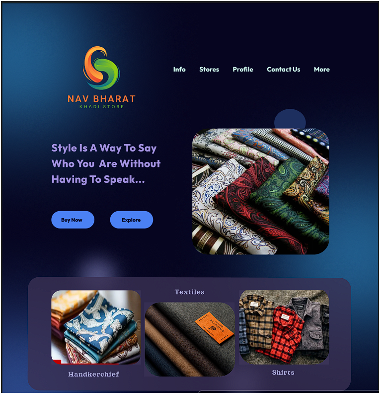

# Nav Bharat Khadi Store

Welcome to the Nav Bharat Khadi Store! This repository contains the Figma design of our store home page.

## Figma Design Link

You can view the design on Figma using the following link:
[Nav Bharat Khadi Store Figma Design](https://www.figma.com/design/B5tywesNVGkG3DiFJoFJok/Nav-Bharat-Khadi-Store?node-id=0-1&t=oiF9X1MrKYOBoupa-1)

## Preview

Here are some previews of the design:




## Description

Nav Bharat Khadi Store is dedicated to providing high-quality khadi products. Our design aims to reflect the traditional and sustainable values of our brand while offering a modern and user-friendly shopping experience.

## Features

- Clean and modern design
- User-friendly navigation
- High-quality images showcasing our products
- Responsive design for mobile and desktop

## Getting Started

To get started with the design and implementation, clone this repository and follow the instructions below.

### Prerequisites

- [Figma](https://www.figma.com/) account to view and edit the design
- Basic knowledge of HTML, CSS, and JavaScript

### Access the file in Figma
    ```

2. Open the `Nav Bharat Khadi Store.fig` file in your browser/software to view the design.

## Contributing

We welcome contributions to improve our store design. Please feel free to fork the repository and submit pull requests.


